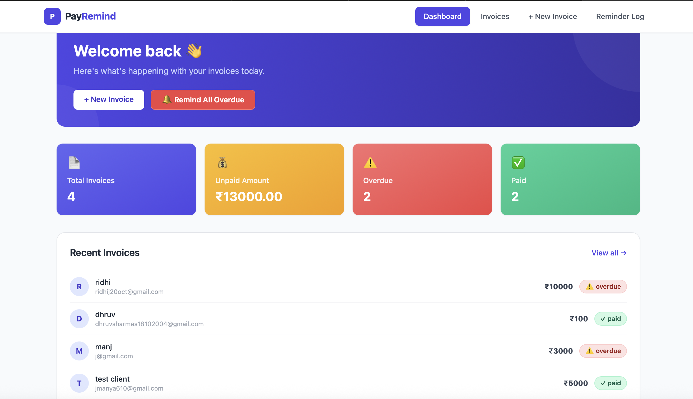
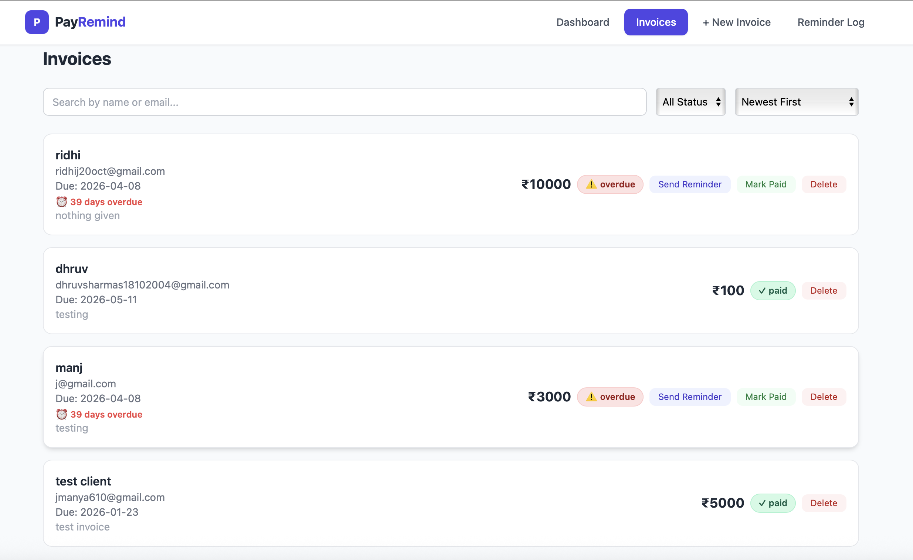
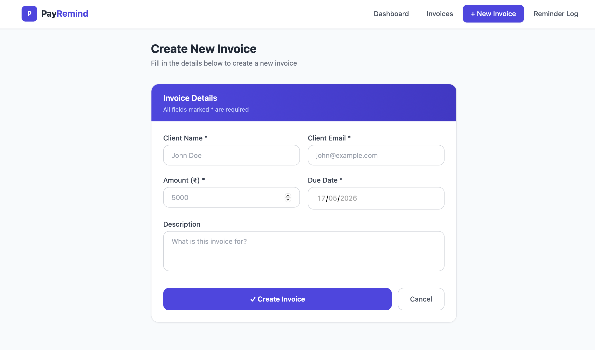
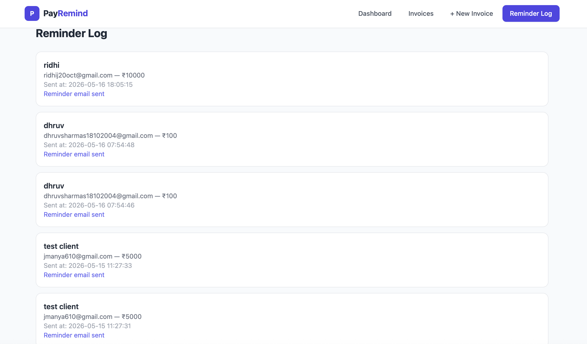

# 💰 PayRemind — Payment Reminder System

A clean, fast, and fully functional payment reminder system built for small businesses to track invoices, send real email reminders, and manage payment status — all from one place.

---

## 📸 Screenshots

### Dashboard


### Invoices


### New Invoice


### Reminder Log


---

## ✨ Features

- 📄 Create, view, and manage invoices
- 🔔 Send real email payment reminders via Gmail
- ✅ Track payment status — pending, paid, overdue
- 🔍 Search and filter invoices instantly
- 📊 Dashboard with live summary stats
- ⏰ Due date countdown on every invoice
- 🔴 Bulk remind all overdue clients in one click
- 🔃 Sort invoices by amount or due date
- 📋 Recent invoices shown directly on dashboard
- 🚨 Auto overdue detection — no manual work needed

---

## 🛠 Tech Stack

| Layer | Technology |
|---|---|
| Frontend | React, Vite, Tailwind CSS |
| Routing | React Router |
| HTTP Client | Axios |
| Backend | Node.js, Express |
| Database | SQLite (better-sqlite3) |
| Email | Nodemailer + Gmail SMTP |
| Dev Tools | Nodemon, dotenv |

---

## 📁 Project Structure

```
payment-reminder/
├── client/                 
│   └── src/
│       ├── components/     
│       │   ├── Navbar.jsx
│       │   └── StatusBadge.jsx
│       ├── pages/          
│       │   ├── Dashboard.jsx
│       │   ├── Invoices.jsx
│       │   ├── NewInvoice.jsx
│       │   └── ReminderLog.jsx
│       └── api.js          
└── server/                 
    ├── routes/             
    │   ├── invoices.js
    │   ├── dashboard.js
    │   └── reminders.js
    ├── db.js               
    ├── mailer.js           
    ├── index.js            
    ├── .env.example        
    └── .gitignore
```

---

## 🚀 Setup Instructions

### 1. Clone the repository

```bash
git clone https://github.com/manyajain10/payment-reminder.git
cd payment-reminder
```

### 2. Setup Backend

```bash
cd server
npm install
```

Create a `.env` file inside the `server` folder:

```
PORT=3001
EMAIL_USER=your_gmail@gmail.com
EMAIL_PASS=your_gmail_app_password
```

Start the backend:

```bash
npm run dev
```

### 3. Setup Frontend

```bash
cd client
npm install
npm run dev
```

### 4. Open the app

Go to: **http://localhost:5173**

---

## 📧 Email Setup

1. Enable 2-Step Verification on your Google account
2. Go to: https://myaccount.google.com/apppasswords
3. Generate an App Password
4. Add it to `.env` as `EMAIL_PASS`

> ⚠️ Never commit your `.env` file — it is listed in `.gitignore`

---

## 💡 Engineering Decisions

**SQLite** — No database server needed. Data stored in a single file. Perfect for this scope.

**Nodemailer + Gmail** — Free, reliable, sends real HTML emails with invoice details.

**React + Vite** — Fast modern frontend with hot reload.

**Tailwind CSS** — Responsive UI without writing custom CSS.

**Express with separate route files** — Each resource has its own route file. Clean and easy to extend.

**Auto overdue detection** — Every API call checks and marks overdue invoices automatically.

**Environment variables** — All secrets in `.env`, never committed. `.env.example` provided for easy setup.

---

## 📌 Available Scripts

### Backend
```bash
npm run dev    # Start with nodemon
npm start      # Start normally
```

### Frontend
```bash
npm run dev    # Start dev server
npm run build  # Build for production
```

---

Built with ❤️ by [Manya Jain](https://github.com/manyajain10)
